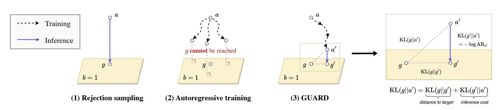

# GUARD



This is the code for **"[Guaranteed Generation from Large Language Models](https://openreview.net/forum?id=8roRgrjbjv)"**, *ICLR 2025*. 

## Create conda environment and install requirements
```
conda create -n guard python=3.10 && conda activate guard
pip install -r requirements.txt
```

## Definition of LLM *a(y)* and constraint *b(y)*
The experiments rely on the [disco](https://github.com/naver/disco) toolbox. Its basic usage is documented in the lexical_constraint.ipynb notebook.  

We define our ideal distribution *g* from the LLM *a* and constraint *b* as follows:
```
a = LMDistribution("google/gemma-2b", token=token, LLM=True) # base LLM a(y)
b = lambda s, c: bool(re.search(r"\bamazing\b," s.text)) # hard constraint on the generated sequence.
scorer = BooleanScorer(b) # transform the hard (binary) constraint into a boolean scorer (1 or 0)
g = a * scorer # gold distribution
```
We experiment with two types of constraint:  
a lexical constraint:

```python
b_lexical = lambda s, c: bool(re.search(r"\bamazing\b," s.text)) # the sequence must contain "amazing".
```

and a sentiment constraint:
``` python
score_tokenizer = AutoTokenizer.from_pretrained("michellejieli/emotion_text_classifier")
score_model = AutoModelForSequenceClassification.from_pretrained("michellejieli/emotion_text_classifier", num_labels=7).to('cuda')

def sentiment_pipe(story): # "joy_class" is the 4th class of output probabilities.
    return Softmax(dim=-1)(score_model(**score_tokenizer(story, return_tensors="pt", max_length=512, truncation=True).to('cuda')).logits)[:,3].item()

def is_positive(story="", t=0.98, prefix=""):
    story = prefix+story
    story = story.split('<|endoftext|>')[0]
    story = story.split('. ')
    if sentiment_pipe(story[-1]) > t:
        return True
    else:
        return False

b_sentiment = lambda s, c: is_positive(story=s.text, t=0.98, prefix=prefix) # the sequence must have a positivity above threshold.
```

## GUARD training and evaluation

Both notebooks, lexical_constraint.ipynb and sentiment_reversal.ipynb, include the CAP, SFT, DPG, and DPG initialized with CAP methods.

### Constraint-Aware Prompting

Rely on a constraint-aware prompt to achieve a higher acceptance rate in a zero-shot manner.

```python
CAP = "Next sentence should contain 'amazing'.\n\n"
distr = AccumulationSampler(distribution=a, total_size=50000)
samples_a, distr_a = distr.sample(sampling_size=250, context="") # sample from a()
samples_a2, distr_a2 = distr.sample(sampling_size=250, context=CAP) # sample with a(|CAP)
```

### Supervised Fine-Tuning

Sample many *y* from *a()* and filter it based on *b(y)=1*.

```python
distr = AccumulationSampler(distribution=a, total_size=800000)
samples_a, distr_a = distr.sample(sampling_size=500, context="")
samples_g = []

for it, item in enumerate(samples_a): # y ~ a
    if b(item, _): # if b(y) = 1
        samples_g.append({'text': item[1]}) # return y
```
Then, just fine-tune LLM on samples_g.

### Distributional Policy Gradients
Adaptively sample *y* from policy *a_theta()*, and train distributional reward to match with ideal distribution $g$.

```python
frozen_a = LMDistribution("google/gemma-2b", token=token, LLM=True) # reference a()
a_theta = LMDistribution("google/gemma-2b", token=token, LLM=True, freeze=False) # policy
b = lambda s, c: bool(re.search(r"\bamazing\b", s.text)) # hard constraint # constraint b
scorer = BooleanScorer(b)
g = frozen_a * scorer # ideal distribution g

# DPG training
tuner = DPGTuner(a_theta, g,
        context="",
        n_gradient_steps=400,
        n_samples_per_step=10000,
        sampling_size=500,
        scoring_size=500,
        divergence_evaluation_interval=10)

ConsoleLogger(tuner)

tuner.tune()
```

For DPG with CAP, see detailed code in each notebook.

To cite **Guard**, please use:
```
@article{kim2024guaranteed,
  title={Guaranteed Generation from Large Language Models},
  author={Kim, Minbeom and Thonet, Thibaut and Rozen, Jos and Lee, Hwaran and Jung, Kyomin and Dymetman, Marc},
  journal={arXiv preprint arXiv:2410.06716},
  year={2024}
}
```

## License

See [LICENSE](LICENSE) file.

